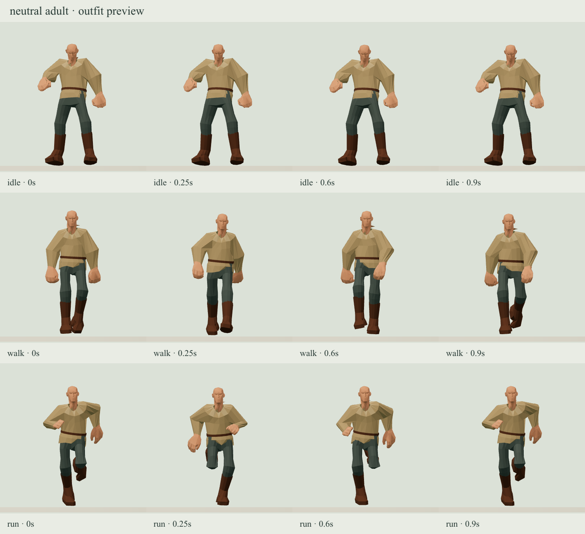
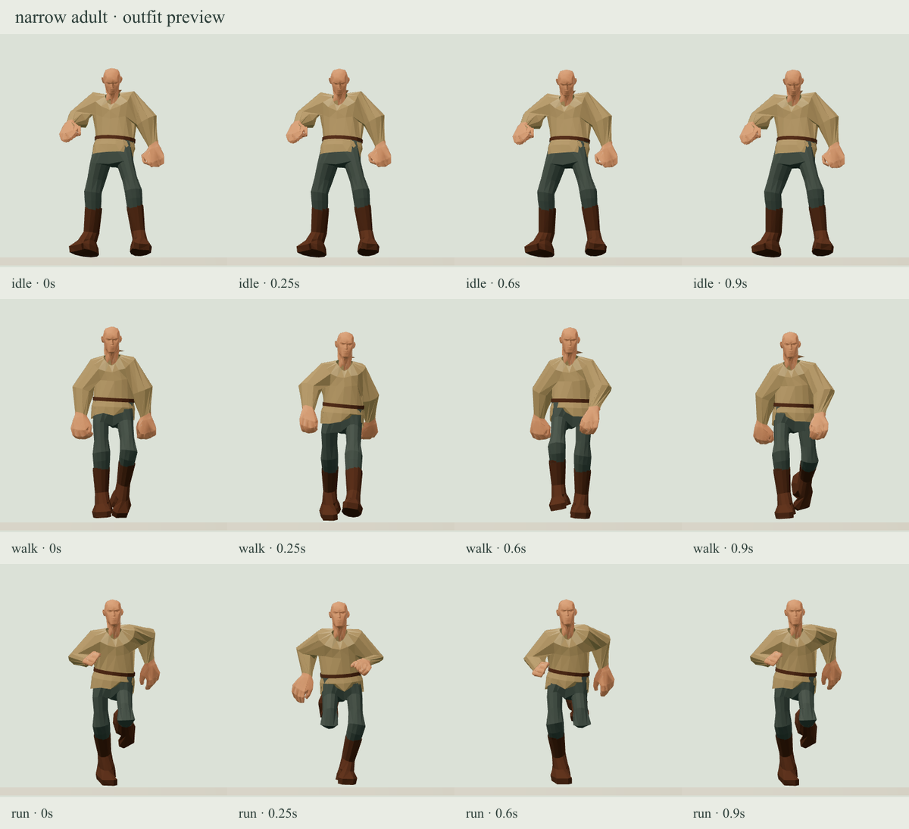
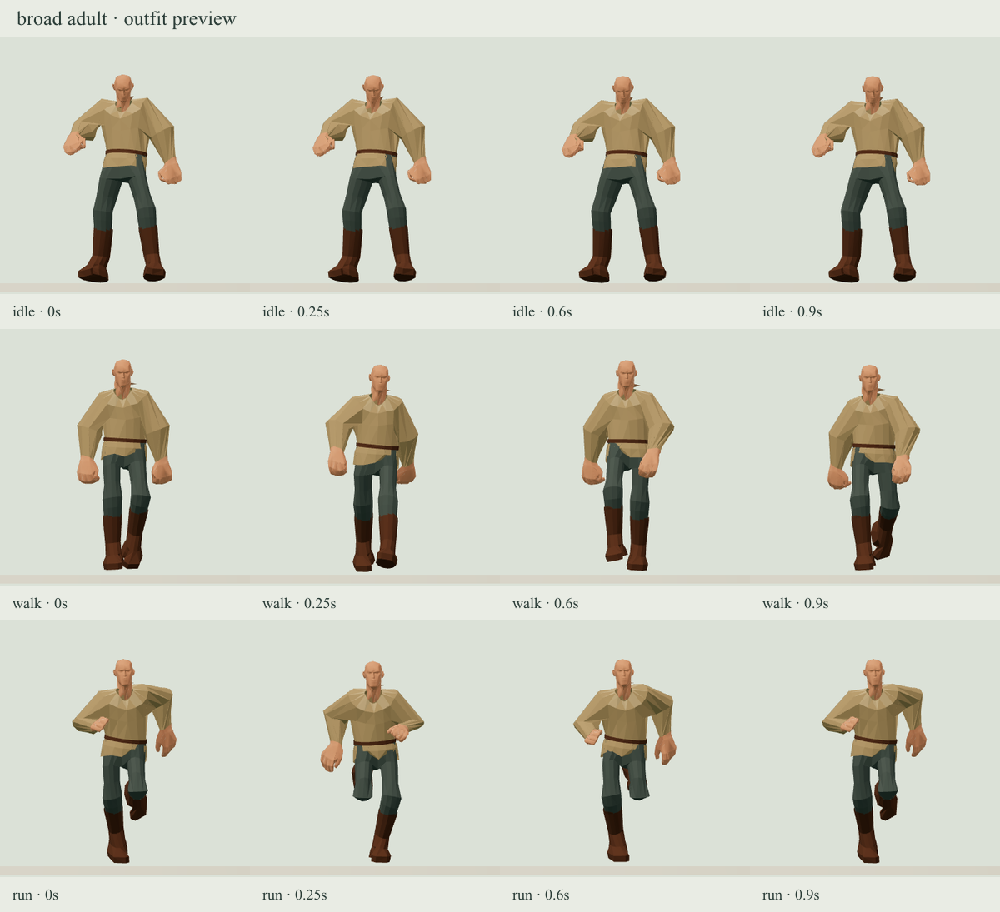
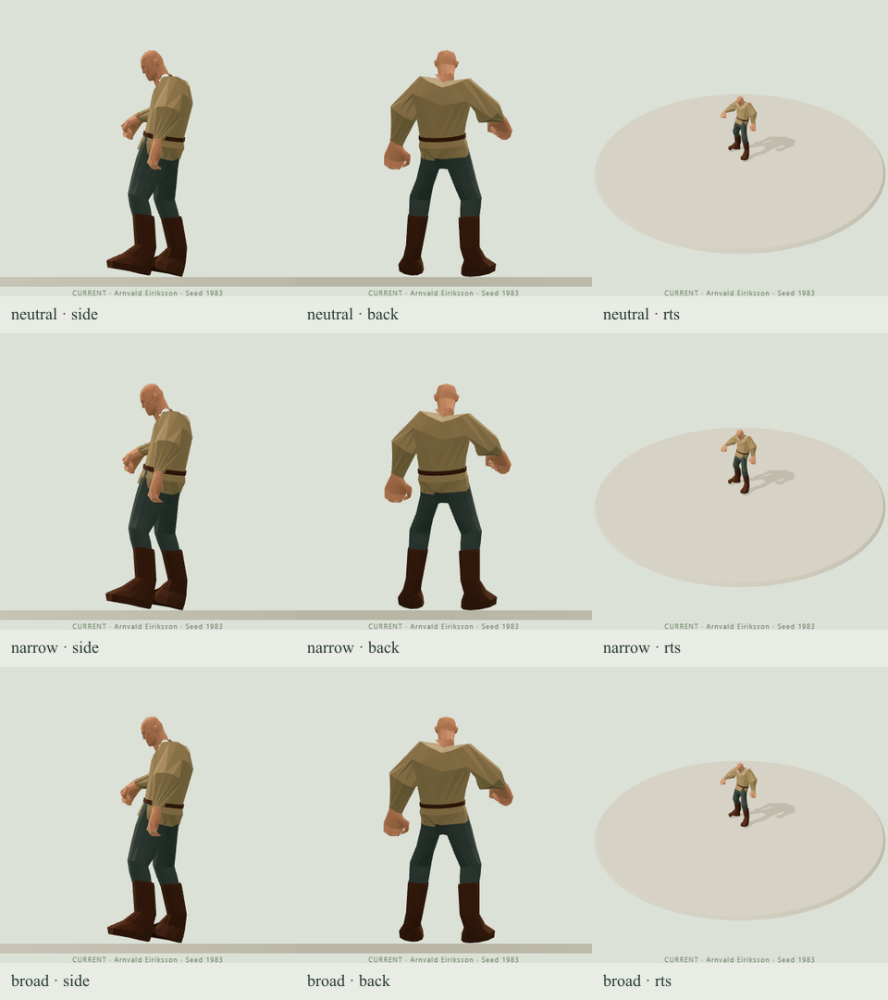

# Meshy Human outfit fitting proof — 2026-10-08

The user treats this tunic/trousers/boots as a **technical fitting fixture**. Clothing artwork quality is deferred. All four body-bound fixtures remain previews with null appearance approval. The existing native adapter, sockets, bindings, swaps and source ownership are retained. No arbitrary-model fitting or library expansion is claimed.

## Frozen inputs and output

- Original master: Assets/Characters/Human/Human-textured.glb, SHA-256 be5173fa4f3b6e63fa7bc3506b3d61b4def28b7f67477b9a29b5eb527d80f8fe.
- Native SmartRigArmature/Mixamo: 44 joints and 14 preserved clips. No second character rig, body textures or clips are included in the module.
- Prepared body LODs: 7,644 / 3,221 / 3,219 triangles. Exact body hashes are recorded in the proposal and sidecar.
- Outfit GLB: 8bdc3b76b7c13ff18d836c52fc15635c6e51b4c34161a2f90694ba4f2e3baf40; 149560 bytes, 824 authored triangles, one material, four broad linear colours.
- Binding: 5deca084f0779131ede0427d6fac5cc98dbaf696a879612dea9c174fcd089834; rig signature 2d2ac28dd1d76d8f20566c7a55ac2e2ebd826ba674b73ccfd54962fc08ef22bc.
- Blender 4.5.9 LTS recipe: scripts/characters/templates/meshy_modules_v2.py, SHA-256 f3eccd8774259fb21502c87dc4948621623702fee3cae9f10adeae80ac29e6fa.
- Export pipeline: scripts/prepare-meshy-modules.mjs, SHA-256 086a423ce3815ed1a90e2f305cf5b7cf2b9c7b2b5424b141f81b7723c184e837.
- Editable source: Assets/Characters/Human/Modules-v2/MeshyHuman_modules-v2.blend, SHA-256 e20a7aea8fbcb7b157eff51523fc3c499582d80532802d38212052e6ee6982bc. The local source is retained in Assets; the recipe and frozen runtime exports are tracked.

## Fitting behavior

The fixture uses designed panels and articulated sleeve/leg/boot loops. Free sleeves use arm-region weights, including inner elbow points that would otherwise inherit torso weights. Fixed wrist rims come from the actual source section rather than a circular approximation.

Each LOD maps cuff contacts directly onto its own body surface with zero stand-off. Free panels and other authored stand-offs preserve their exported positions. Contact relocation is bounded at 5mm by the factory test. Owned skin and clothing geometry receive the union of their opening corners, avoiding mismatched boundary chords after body simplification. Both use the same native skeleton and at most four native influences. Whole-triangle coverage is combined with partial cuff cuts; removal restores the exact original body geometry. Dependencies, independent instances and frozen binding snapshots remain supported.

## Verification

- Public Meshy factory: age 32, morphology masculinity 1 and height 1.5; neutral, narrow and broad adult builds at all three body LODs; Idle, Walk and Run at 0 / 0.25 / 0.6 / 0.9 seconds — **108 samples**. Visible body/outfit proper interior crossing pairs: **zero** in every sample. The unchanged surface audit detects strict interior crossings, including shared-correspondence crossings away from their shared edge.
- Native runtime validator: 13 instances, four retained module proofs, 108 motion samples; fixed contacts, source/rig/LOD identities, seam continuity, finite skinning, coverage restoration and dependencies pass. Joined body/clothing rims stay within 10 microns during those poses. Four-influence contact and inserted-skin reduction retain the 8mm bound. Playback performs **zero refits**.
- Existing Character Lab browser controls: neutral preset; narrow = Slight + Underweight at 1; broad = Powerful + Overweight at 1. Existing 60% build strength is preserved. Idle_02 / Walking / Running were frozen at the same four times, with front views and side/back/fixed RTS views. Screenshots were visually inspected; no browser errors were recorded.
- Full test runner: **424 passed, 0 failed, 2 optional tests skipped** (426 total). Skips are the absent generated-house fixture set and absent historical r3 frozen exports, not earlier failing checks. Required local character validation passes: 20 assets / 36 GLBs, legacy Golden checks plus the native audit.
- TypeScript and production build pass. Vite retains its large-chunk warning for meshopt_decoder; this is not an FPS or crowd-performance measurement.
- Final UI wording identifies the outfit as a fitting test fixture and defers artwork refinement. The focused Lab checks and build are repeated for that text-only change.

## Visual evidence

[Public Lab body settings and exact binding identities](public-lab-evidence.json) accompany these views. All are actual renders from the same frozen 3D export through the ordinary Character Lab, not separate generated concepts.

## Limits and next use

Qualification is bounded to the tested adult shape/motion samples. Child/older qualification, other clips, compound extremes, continuous collision guarantees, coplanar overlap, solid-volume penetration and matched World performance remain outside this milestone. The geometric audit does not certify the source body's self-intersection behavior or manifoldness. Opening subdivision adds a small number of runtime triangles; 824 is the authored export count.

More detailed Meshy clothing can use this foundation after preparation against the same human: retain matching opening rims, bind to the native rig, author free-panel weights, hide only declared covered body regions and regenerate the exact LOD sidecars. This is not automatic fitting of an arbitrary Meshy export. Independent appearance approval remains required before promotion; it is not the gate for this fitting fixture.
