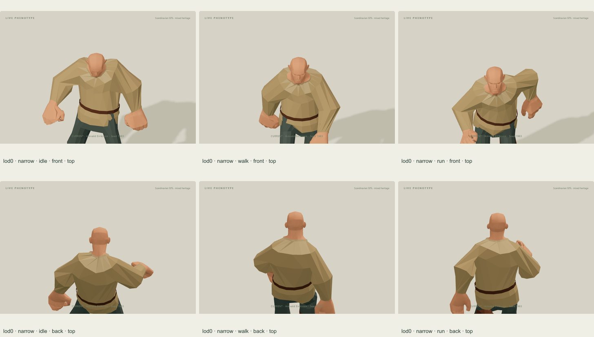
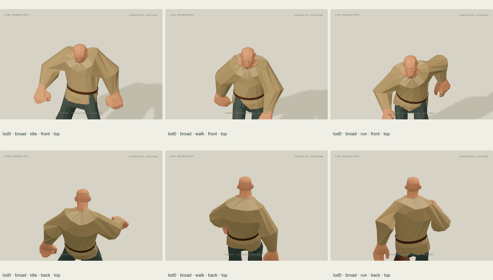
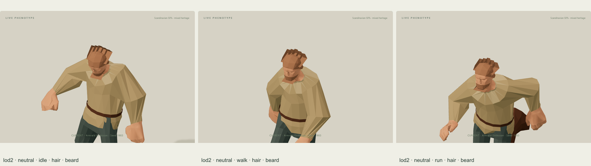

# Meshy Human neck fitting follow-up — 2026-10-08

The user reported missing exposed neck skin above the tunic in the original Character Lab. Original neck vertices sometimes have dominant arm influences. Arm-first semantic classification let sleeve coverage remove them. A collision audit could not detect missing skin. The new public-factory regression tests visible neck coverage separately from collisions.

This remains a technical fitting fixture. Artwork refinement and more detailed Meshy clothing are deferred; all native module fixtures remain previews with null appearance approval. The [earlier outfit report](../meshy-modules-v2/REPORT.md) is preserved with its original export and measurements.

## Frozen source and output

- Original master SHA-256: be5173fa4f3b6e63fa7bc3506b3d61b4def28b7f67477b9a29b5eb527d80f8fe. It is unchanged.
- Native rig signature: 2d2ac28dd1d76d8f20566c7a55ac2e2ebd826ba674b73ccfd54962fc08ef22bc; 44 original joints, 14 preserved clips.
- Outfit: 08d9a96b14293f9566c66f30eb5120bf98effbdc34f5f9b3a0e1b68239c594a7; **1045 authored triangles, 189340 bytes**, one material and four broad linear colours.
- Binding: ef466f4f94c2c27273e394ef7b75987f696f708de293d61887c508d9a91b23fe.
- Blender recipe: scripts/characters/templates/meshy_modules_v2.py, SHA-256 f533df79197f5e0cb28528a5807429d6322b52cee4a26d3522ca2bc2a2571f70; Blender 4.5.9 LTS.
- Export pipeline: scripts/prepare-meshy-modules.mjs, SHA-256 9bc2b9be1d73929c9f482ce65527494c6be2e6c2234f4da9cea964c21338c72f.
- Editable source: Assets/Characters/Human/Modules-v2/MeshyHuman_modules-v2.blend, SHA-256 91c27d448c6e0c5ddc6cd1c21e842fb4fa57de313cfaf4e28784837b8d40df08. Retained locally in Assets; the recipe and runtime exports are tracked.
- Exact body LOD hashes are recorded in the binding and every browser snapshot; all three prepared body files remain unchanged.

## Repair

Protect the geometric head/neck regions before interpreting native limb weights. Clip only actually covered neck skin along the matching authored neckline plane, instead of removing a whole neck triangle by an average height. The collar and owned body use the actual native section topology at each LOD. A densely sampled collar band follows those contacts with the same skin influences; free panels retain their authored volume.

The final neck plane is y + 0.3z = 1.415 metres in source bind coordinates. It has one closed source-section component at all three LODs, avoiding a separate small native contour at lower heights in the simplified body. All original contact vertices and inserted body-LOD corners are welded to the visible owned body with byte-identical raw bind positions and four native influences. Recursive clipping retains the full original mixture until final reduction. The original body geometry, textures, rig and weights are not edited. Outfit removal restores the original geometry.

## Verification

- Public factory neck regression: **54 bind-surface ray observations** across LOD0/LOD1/LOD2. Where the actual outfit does not occlude the original neck, visible owned skin must match it within 10 microns; at least six genuinely exposed samples remain per LOD. The regression was red on the previous missing-neck fixture and is green on this export.
- Existing strict surface audit: **108 adult samples**, neutral/narrow/broad, all three LODs, Idle/Walk/Run at 0 / 0.25 / 0.6 / 0.9 seconds. Visible body/outfit proper interior crossing pairs: **zero** in every sample. The audit and its zero-crossing assertion are unchanged.
- Full character validation with explicit Lab previews: **PASS**, 20 assets / 36 GLBs; 12 Golden characters / 19 equipped legacy cases, plus the native audit of four module proofs / 13 instances / 108 motion samples. Exact source/rig/LOD identities, finite native skinning, seam continuity, coverage restoration, dependencies and independent ownership pass. Shared rim continuity retains its 10-micron bound; full-mixture to four-influence transport retains the 8mm bound. Ordinary playback performs zero refits.
- Full suite on this repair: **429 tests — 427 passed, 0 failed, 2 optional skips**. The skipped fixture-dependent cases are generated houses/yards and historical r3 frozen GLBs. They are not skipped because an earlier check failed.
- TypeScript and production build: **PASS**. Vite retains the existing large-chunk warning for meshopt_decoder. No crowd performance claim is made.
- Changed handwritten fitting helpers and the new test were manually formatted/reviewed, and the diff whitespace check passes. No project formatter is configured, so no automatic formatting check was available.

## Actual Character Lab views

33 views were captured through the existing Lab controls and public snapshot import/export: Idle_02, Walking and Running frozen at 0.6 seconds; bare-neck front/top and back/top for neutral, narrow and broad LOD0, plus neutral LOD1/LOD2; three LOD2 front/top views with the existing hair and beard. All 33 were visually inspected. The neck skin remains connected above the collar in these views. Exact body, DNA, camera, pose and binding identities accompany them in [public Lab evidence](public-lab-evidence.json). Browser errors: zero. The browser DNA height is 1.5056687145773322; the numeric audit uses 1.5.

## Limits

These are bounded adult fitting checks and sampled views. They do not certify arbitrary Meshy clothing, other poses, child/older fitting, continuous collision freedom, source-body self-intersections, solid-volume penetration or crowd performance. The authored export count excludes runtime opening subdivision. No appearance approval or World wardrobe promotion is implied.
