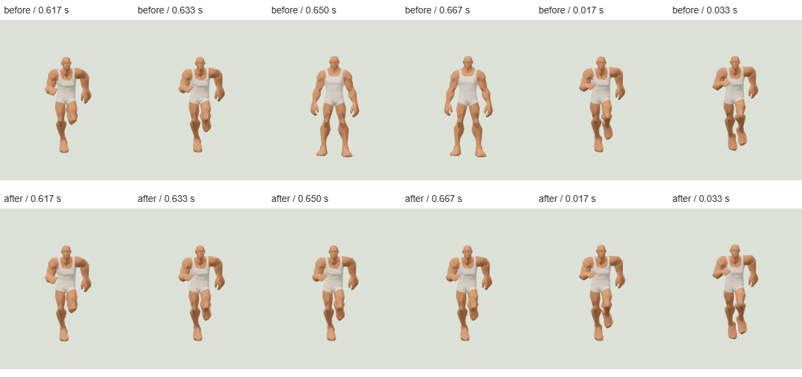

# Meshy Human Running pose follow-up

Date: 2026-10-09. Branch: codex/character-modules-v2.

Running no longer jumps into the standing rest pose just before repeating. The
user's recording showed that pose at approximately 1.183 s of video time. A
controlled continuous replay reproduced the defect in the preceding commit
3663f4e and confirms its removal with the same source, body, camera and frame steps.

## Cause and change

The complete Running clip is 0.6666666865348816 s. Most rotation tracks stop at
0.6333330273628235 s and hold their final value until the complete clip endpoint.
These source values are preserved.

The runtime reset every joint to its rest quaternion before advancing the mixer.
Three's PropertyMixer avoids writing values that have not changed. During held
keys, the reset therefore remained visible instead of the authored animation pose.
The earlier duration/end-pose checks did not inspect every continuously played
frame and missed this behavior.

Each Human now retains the mixer's unmodified rotations. It restores that pose
before advancing, captures the new animation pose, and then applies DNA adjustments
once. Sampling and DNA changes also refresh the saved pose. No clip duration,
source key, source GLB or prepared LOD GLB is edited. No mixer internals are accessed.

## Visual review

The six consecutive frames below advance from 0.600 s with real update(1/60) calls.
There are no per-frame sampling/freeze calls. The upper row uses the preceding
committed runtime; the lower row uses this change. Both use the public factory,
actual LOD2 GLB and the same renderer/camera. All twelve frames were inspected.
The previous runtime stands at 0.650/0.667 s; the changed runtime retains Running.



[Exact replay timestamps](replay-evidence.json).

A separate six-second observation exercises the original Character Lab's visible
Running selector. Its 147 observed frames include three late-clip captures at
0.648, 0.662 and 0.657 s. All three captures retain the running pose and were
visually inspected. There were no browser page errors.

- [Late-clip view at 0.648 s](held-frame-0.png)
- [Late-clip view at 0.662 s](held-frame-1.png)
- [Late-clip view at 0.657 s](held-frame-2.png)
- [Actual Lab visible clock evidence](live-evidence.json)

The browser uses a software GPU. These timings and captures demonstrate playback
behavior, not device or crowd performance.

## Regression and checks

- The new public-factory regression failed before the change, then passed. It
  compares continuously played poses with exact frozen GLB samples through held
  keys and loop boundaries: LOD0/1/2, 30/60/120 FPS, three cycles per case. This
  checks 1,269 frames and all 44 joints per frame, with a 1e-6-radian bound.
- A separate 180-frame LOD2/60 FPS diagnostic found a maximum normalized quaternion
  difference of 0.0000038182 degrees after the change.
- The existing source-duration regression still passes for all 14 clips at every
  LOD, including endpoint holds and DNA changes.
- Full local suite: **431 tests, 429 passed, 0 failed, 2 existing optional skips**.
  Skips concern unavailable generated-house and historical r3 fixtures.
- TypeScript, production build and full character validation passed, including
  explicit Lab-preview audits. The existing large-bundle warning remains.
- No formatter is configured. Changed code was manually formatted and checked with
  git diff --check; the browser script also passed node --check.

[Verification and unchanged master/LOD hashes](verification.json).

Reproduce the frame regression with:

```text
node --test tests/meshy-animation-timing.test.mjs
```

For the live browser captures and before/after replay, run
scripts/meshy-running-pose-smoke.mjs with PROTOTYPE_URL, PLAYWRIGHT_MODULE and,
where needed, BROWSER_CHANNEL and GIT_BIN. It writes to ignored artifacts and
scratch; it adds no product Lab or route.

## Scope

This corrects runtime rest-pose flashes. Authored holds and the original loop seam
remain intact. It does not certify every source clip as artistically seamless.
The source body is used for pose comparison. Native outfit previews retain their
previous adult neutral/narrow/broad Idle/Walk/Run qualification; no clothing artwork,
library expansion or general fitting is introduced. Earlier timing, neck and
outfit reports remain records of their original measurements.
