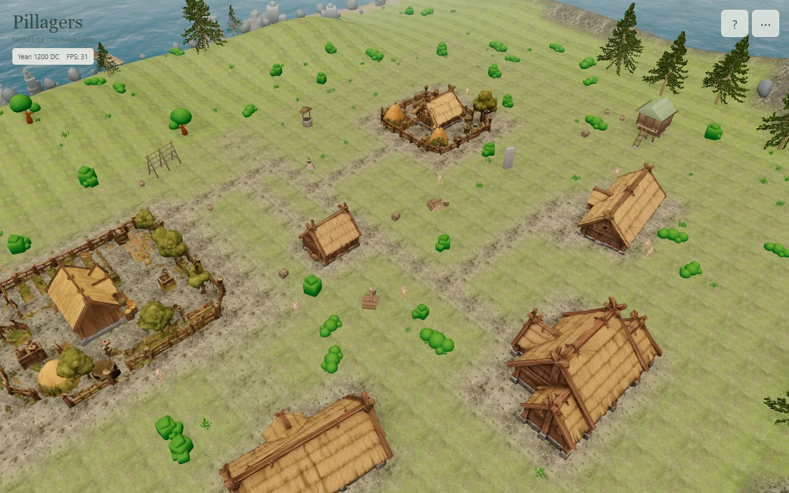

# Resident passing and predictive steering review

2026-10-09. Generated Fjordside, seed 17, ten Meshy residents, Low render quality. Reviewed through the existing world controls in headless Edge with its default GPU backend. This is a functional review, not a frame-rate benchmark. The user's original recording has no exported world seed; the regression fixtures reproduce the blocked-side and crowded-corner geometry rather than claiming an identical world replay.

The movement regression tests were written red-first at the approved public MovementSystem.update() boundary. They cover passing a neighbour beside a wall, leaving a crowded corner through the rear corridor, early terrain steering, ordinary approaching encounters, and encounters during terrain steering. Existing tests retain five-second timing, separation, turn-before-walk behavior and destinations.

The browser run observed 60.49 simulation seconds. All ten residents moved 19.81–37.43 m, excluding annual persona respawns. The longest observed stationary interval outside conversations was 2.09 seconds. Public population snapshots stayed walkable, grounded and at least 0.96 m apart. Both an encounter and route resumption were observed; there were no page errors. The annual summary was continued through its normal button. Raw sampled positions and interaction states are retained in [results.json](results.json).

Stationary time is measured from position changes across an interval. A single zero-speed frame after a turn does not imply that the resident was motionless between observations. Automated movement tests check continuous separation on every update; the browser checks sampled public snapshots.

The existing Debug checkbox shows green/red forward clearance lines and blue committed routes. The review camera was rotated with the player's right-mouse drag to show the residents behind the house.

Validation: 18 movement/navigation tests; TypeScript; production build; strict character preview audit (20 assets, 36 GLBs, 12 Golden Characters, 19 equipped modules). Full PR checks also run build, asset audit and the complete test suite for the current head. No formatter is configured; formatting was checked manually and with git diff --check.

Reproduce with licensed local scenery and prepared house assets present: QA_ORIGIN=http://127.0.0.1:5182 node scripts/qa/check-resident-passing-browser.mjs (set the environment variable using the shell's normal syntax).
